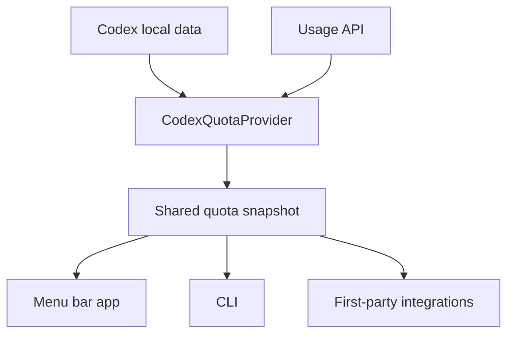
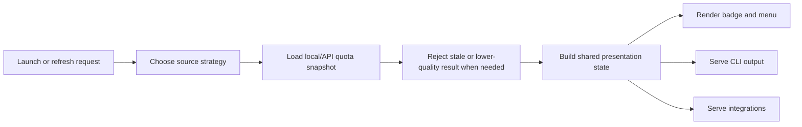

# 架构

[English](architecture.md) | [中文](architecture.zh-CN.md)

这份文档解释 Codex Quota Peek 当前是如何实现的，以及为什么关键设计会落成现在这样。

## 目的与范围

Codex Quota Peek 当前有三个产品表面：

- macOS 菜单栏 app
- 本地 CLI：`codexQuotaPeek`
- 一方集成，目前包括 OpenClaw 状态插件

三者共享同一个目标：

- 快速显示 Codex quota
- 即使官方 UI 没打开也保持有用
- 平时尽量优先本地、轻量的数据路径
- 在用户明确要求时，仍然允许走 API 拉最新值

## 系统上下文

## 模块清单

| 模块 | 职责 | 关键接口 |
| --- | --- | --- |
| App shell | 管理菜单栏生命周期、菜单刷新、偏好设置和外部动作 | `AppDelegate.swift`, `MenuUpdater.swift`, `PreferencesWindowController.swift` |
| Data sources | 读取 API、实时日志、归档会话和 auth 信息 | `CodexQuotaProvider.swift`, `CodexAuthSnapshotStore.swift` |
| Presentation | 把快照转成 badge、菜单行、解释文本和本地化内容 | `CodexQuotaSnapshot.swift`, `QuotaDisplayPolicy.swift`, `StatusBadgeView.swift` |
| Policy layer | 控制刷新优先级、通知去重和 stale 结果拦截 | `QuotaRefreshPolicy.swift`, `QuotaNotificationPolicy.swift`, `RefreshRequestGate.swift` |
| CLI | 通过 `codexQuotaPeek` 暴露共享行为 | `cli_main.swift`, `CliFormatter.swift` |
| Integrations | 让外部工具复用同一份 quota 数据和语义 | `integrations/openclaw-status-codex-quota/` |

## 核心流程

主 app 的刷新路径大致是：

1. 启动时先渲染占位 badge
2. 先用本地数据做一次启动刷新，避免菜单栏为空
3. 再异步走一次 API 刷新，追平最新值
4. `~/.codex/logs_1.sqlite` 和 `~/.codex/auth.json` 的变化触发轻量刷新
5. 保留 `20s` 定时刷新作为兜底
6. 手动 `Refresh Now (API)` 强制走 API
7. 通过共享的 `StatusPresentation` 生成 badge 和菜单显示

## 接口与契约

- 菜单栏 app 是主要体验，但 CLI 和集成要尽量共享同一套 quota 语义
- `% left` 表示真实剩余额度，`! / !! / !!!` 表示节奏风险，不改变真实数值
- 手动刷新始终 API 优先
- 自动刷新允许按策略使用本地日志，但不能让较旧结果覆盖较新已接受结果
- 中英文菜单结构要保持稳定

## 状态与数据模型

核心数据源：

- `~/.codex/logs_1.sqlite`
- `~/.codex/archived_sessions/*.jsonl`
- 官方 usage API
- `~/.codex/auth.json`

共享状态围绕几个对象展开：

- quota snapshot：表示当前配额窗口状态
- fetch result：记录 snapshot、来源和时间
- display state：保存当前已接受结果、最近成功 API 结果，以及重建菜单所需输入

## 运维关注点

- 启动不能把 badge 留空
- 自动刷新失败不能清空一个有效显示状态
- 较旧 reset window 或明显更旧的结果不能覆盖较新的已接受结果
- 语言切换、通知去重和账号切换都要在 UI 和 CLI 契约下保持稳定
- 打包与安装脚本必须保持和 README / RELEASE 文档一致

## 取舍与非目标

- 当前仍保持单 target 代码组织，而不是过早拆成多个 package
- 平时偏向本地和轻量数据路径，不做高频 API 轮询
- 当前公开发布仍未完成 Apple 签名和 notarization
- 目标不是替代官方 Codex 产品界面，而是提供更快的 quota 可见性

## 相关文档

- [需求基线](requirements.zh-CN.md)
- [测试计划](test-plan.zh-CN.md)
- [签名与公证方案](signing-and-notarization-plan.zh-CN.md)
- [发布指南](../RELEASE.md)
